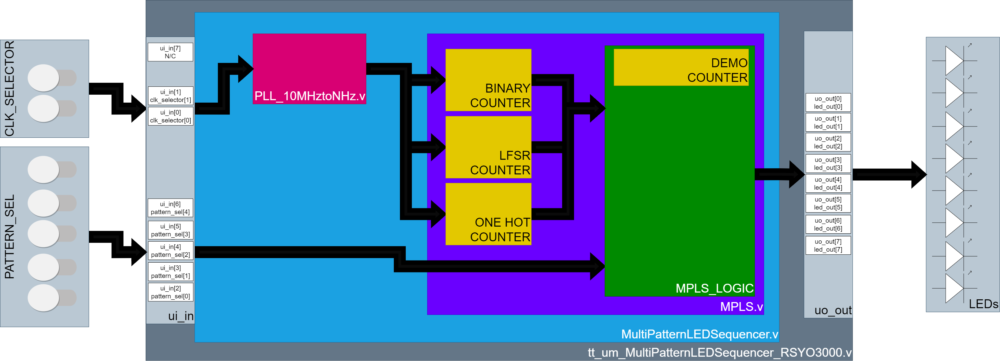

  

# TinyTapeout4 Project: MPLS (Multi-Pattern LED Sequencer)

The **Multi-Pattern LED Sequencer** module generates a variety of LED patterns using a combination of counters, feedback loops, and pattern selection logic. This README provides an overview of the available LED patterns.

## MPLS 31 Pattern Showcase for TT4 in YouTube

In the following video, you can watch a showcase of the 31 patterns in the MPLS described in further sections of this README

**(PD. It has non-copyrighted music from YouTube that it's kinda loud in my opinion, lower your volume or mute it before watching if wearing headphones for safety!)**

https://youtu.be/fap38elbNSM

## How It Works

The project consists of several Verilog modules that work together to create a variety of LED patterns:

- `tt_um_MultiPatternLEDSequencer_RSYO3000.v`: This serves as a wrapper for the tinytapeout I/O. Within this wrapper, you'll find a top-level module named `MultiPatternLEDSequencer.v`.

- `MultiPatternLEDSequencer.v`: This top-level module interfaces with the tinytapeout wrapper and instantiates two key modules: `PLL_10MHztoNHz.v` and `MPLS.v`.

- `PLL_10MHztoNHz.v`: This module includes Verilog code to adjust the input frequency of 10MHz to different frequencies, such as 1Hz, 2Hz, 5Hz, and 50Hz. This enables the LEDs to display patterns at various frequencies using the `clk_selector` signal.

- `MPLS.v`: The core of the project, this module utilizes counters, feedback loops, and pattern selection logic to generate a diverse range of LED patterns. The pattern selection signal `pattern_sel` determines which LED pattern is displayed.

  - The `demo_counter` is responsible for cycling through all available patterns when `pattern_sel` is set to 31.

  - Both `pattern_counter` and `oh_counter` generate specific timing sequences required for different LED patterns.

  - The `lfsr_reg` implements a Linear Feedback Shift Register (LFSR) to generate pseudo-random sequences.

  - A `case` statement selects the pattern to be displayed based on the value of `pattern_sel`. There are 30 available patterns, each producing a unique LED showcase.

## LED Patterns
- **Pattern 0: All LEDs OFF**
  Turn off all the LEDs.

- **Pattern 1: All LEDs ON**
  Turn on all the LEDs at once.

- **Pattern 2: Blinking LEDs**
  Make the LEDs alternate between on and off, creating a blinking effect.

- **Pattern 3: Running lights**
  The LEDs move in a sequence, like lights running down a line.

- **Pattern 4: Alternating LEDs**
  Alternate the LEDs in an on-off pattern.

- **Pattern 5: Negative running lights**
  Similar to pattern 3, but with the LEDs off where they were on, and vice versa.

- **Pattern 6: KR effect**
  The LEDs flicker and shift, producing a mysterious "Knight Rider" effect.

- **Pattern 7: Bouncing lights**
  Lights bounce back and forth.

- **Pattern 8: LED wave effect**
  Create a wave-like pattern that travels along the LEDs.

- **Pattern 9: Alternating LED groups**
  Divide the LEDs into groups of 2 that alternate turning on and off.

- **Pattern 10: Heartbeat**
  Make the LEDs pulse in a heartbeat-like rhythm.

- **Pattern 11: p-Random LFSR LEDs**
  Use a random number generator to make the LEDs light up in a pseudo-random pattern.

- **Pattern 12: XOR All**
  XOR all counters, creating a unique show.

- **Pattern 13: Binary counter**
  Display a binary counting sequence on the LEDs.

- **Pattern 14: Clockwise LED rotation**
  Rotate the LEDs in a clockwise direction.

- **Pattern 15: XOR Pattern**
  XOR between one hot counter and binary counter.

- **Pattern 16: Bouncing lights**
  Similar to pattern 7, but with a slightly different bounce effect.

- **Pattern 17: Diagonal Bounce**
  Make the LEDs bounce diagonally across the LEDs.

- **Pattern 18: Circular Bounce**
  Create a circular bounce effect, like lights moving in a loop.

- **Pattern 19: Random Bounce**
  The LEDs bounce pseudo-randomly.

- **Pattern 20: Negative Diagonal Bounce**
  Like pattern 17, but with the LEDs off where they were on, and vice versa.

- **Pattern 21: Accelerating Bounce**
  The bouncing effect speeds up over time.

- **Pattern 22: Gravity Effect**
  LEDs appear to "fall" downward, creating a gravity-like effect.

- **Pattern 23: Spring Effect**
  Like pattern 8, but with a spring-like bounce in the wave effect.

- **Pattern 24: Reflecting Bounce**
  Create a bouncing pattern that reflects off the edges.

- **Pattern 25: Double Bounce**
  Similar to pattern 17, but with the middle LEDs on.

- **Pattern 26: Wave Bounce**
  A wave-like pattern that bounces back and forth.

- **Pattern 27: Breathing Effect**
  Make the LEDs "breathe" by gradually brightening and dimming.

- **Pattern 28: Alternating Binary and One-Hot**
  Switch between binary counting and one-hot encoding.

- **Pattern 29: Alternating LFSR and One-Hot**
  Alternate between the LFSR sequence and one-hot encoding.

- **Pattern 30: Alternating LFSR and Binary**
  Switch between the LFSR sequence and binary counting.

- **Pattern 31: DEMO**
  This mode cycles through all the available patterns automatically, showcasing the variety of the patterns.

## How to Test

To test the `MPLS` module, follow these steps:

- To create a simulation displaying all the patterns, navigate to the `src` folder and run the following target: **make mpls_sim** This command will execute the testbench using Icarus Verilog, simulating all patterns with a fixed simulation time suitable for observing the patterns.

- There's an additional target for simulating the PLL and converting 10MHz to frequencies of 1Hz, 2Hz, 5Hz, and 50Hz in conjunction with the MPLS module. However, running this simulation is not recommended due to potentially large VCD file sizes. To run this simulation, use the following command in the `src` folder: **make tt_sim** 

Please note that the second target (`tt_sim`) is designed for extended testing and may generate large VCD files (up to 16GB) if left to run for an extended duration, the (`mpls_sim`) is enough to simulate the functionality of the circuit.

# What is Tiny Tapeout?

TinyTapeout is an educational project that aims to make it easier and cheaper than ever to get your digital designs manufactured on a real chip!

Go to https://tinytapeout.com for instructions!

## How to change the Wokwi project

Edit the [info.yaml](info.yaml) and change the wokwi_id to match your project.

## How to enable the GitHub actions to build the ASIC files

Please see the instructions for:

- [Enabling GitHub Actions](https://tinytapeout.com/faq/#when-i-commit-my-change-the-gds-action-isnt-running)
- [Enabling GitHub Pages](https://tinytapeout.com/faq/#my-github-action-is-failing-on-the-pages-part)

## How does it work?

When you edit the info.yaml to choose a different ID, the [GitHub Action](.github/workflows/gds.yaml) will fetch the digital netlist of your design from Wokwi.

After that, the action uses the open source ASIC tool called [OpenLane](https://www.zerotoasiccourse.com/terminology/openlane/) to build the files needed to fabricate an ASIC.

## Resources

- [FAQ](https://tinytapeout.com/faq/)
- [Digital design lessons](https://tinytapeout.com/digital_design/)
- [Learn how semiconductors work](https://tinytapeout.com/siliwiz/)
- [Join the community](https://discord.gg/rPK2nSjxy8)

## What next?

- Submit your design to the next shuttle [on the website](https://tinytapeout.com/#submit-your-design), the closing date is 8th September.
- Share your GDS on Twitter, tag it [#tinytapeout](https://twitter.com/hashtag/tinytapeout?src=hashtag_click) and [link me](https://twitter.com/matthewvenn)!
